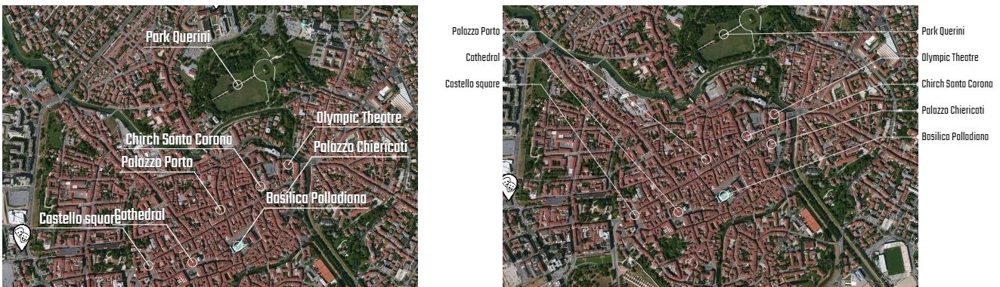

<h2>Example inquieries the possibility of use ol3's class
    <a target="_blank" href="http://openlayers.org/en/v3.14.0/apidoc/ol.source.ImageCanvas.html"> ImageCanvas</a> </h2>

Usually a web map application shows a background map, overlapped by markers or vector elements (eg. points, lines, polygons)

I investigated the possibility to use icons which are not dinamically generated or connect external labels with markers.

A possible approach could consist in the use of external JS library to cover the map canvas. Ol3 offers a class <a href="http://openlayers.org/en/v3.14.0/apidoc/ol.source.ImageCanvas.html"> ImageCanvas</a> which supports the overlay with drawn generated content

    <a href="https://cdn.rawgit.com/pafavero/map-image-canvas/master/index.html" target="_blank" >Show preview</a>

        